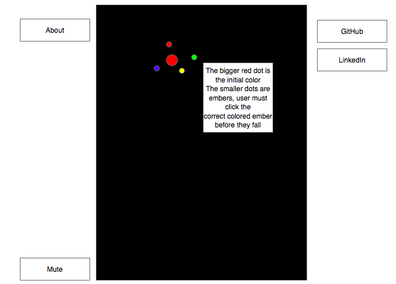

# javascript-proposal

# Background
FireWorks is a single player game where the objective is to keep the firework going by clicking on the correct colored ember.

# Technology Used
* JavaScript for game logic
* HTML5 Canvas for display

# MVP
* Start game by first initial click
* Keep game alive by clicking correct color
* Reset game if user loses

# Wireframes
The app will be one screen, with canvas to render game, mute controller, links to GitHub and LinkedIn, and about modal.

### Firework
User starts the game by clicking on an unlit firework, the firework will shoot up the screen and burst, once the color bursts the user needs to click on the correct colored ember to keep the game alive.

### Sound
Sound will be implemented for a launch effect and explosion effect. Users can toggle the sound on/off.

# Bonus Features
* Select different firework shapes
* Change difficulty
