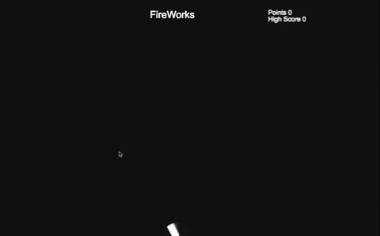
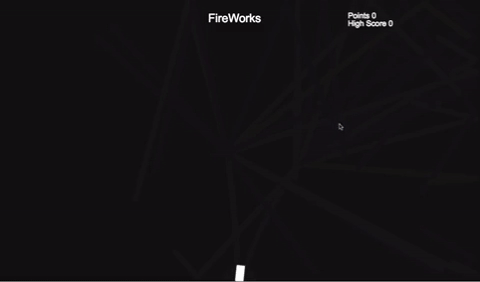

# FireWorks
Play my game! [Live](https://jomartinez27.github.io/FireWorks/)

## ABOUT
FireWorks is a JavaScript point and click game where users need to click on the correct ember to score points before the ember dies!

## Technology Used
* JavaScript for game logic
* HTML5 for rendering images and sound

## Features
### Mouse Tracker

The canvas has a mouse track event listener for the cannon, users can shoot in different places

### Collision


When users click on the correct ember the game keeps going and users score points. I created a function that uses the Pythagorean theorem to get the distance between two points. If that distance is less than 10, (the particle radius + 3 to get a really close distance) The particle will disapear and a new cannonball will shoot triggering a new set of explosions.

```JavaScript
function getDistance(x1, y1, x2, y2) {
  let xDistance = x2 - x1;
  let yDistance = y2 - y1;

  return Math.sqrt(Math.pow(xDistance, 2) + Math.pow(yDistance, 2));
}

  for (var j = 0; j < explosions.length; j++) {
    explosions[j].upate();
    let particle = explosions[j].particles[0] || new Particle();
    let x1 = particle.x || 0;
    let y1 = particle.y || 0;
    particle.color = cannonball.color

    if (getDistance(x1, y1, mouse.x, mouse.y) < 10) {
      particle.timeToLive = 0
      cannonballs.push(cannonball);
      points += 1
      sound.playbackRate = 1.7;
      sound.play();
    }
  }
```

If a user clicks on the correct ember the point will increase and a firework sound will play
